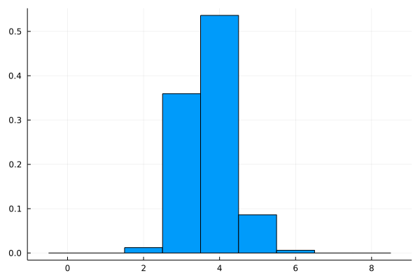

Jurdler - Julia Wordle Solver
=================

Worlde is a web game to guess a 5 letter word in 6 guesses. With each guess, you're told which characters in your guess that match the solution word in the same postion. You're also told if the letter is in the final word but in the wrong position.

Jurdler is a julia language based solver of wordle. It solves the game by 1) selecting the word with the highest entropy gained and based on this 2) filtering the set of solution words.

# Getting started
To run Jurdler, first install [julia](https://julialang.org/downloads/). Once in julia's REPL, use the julia package manager to install the DelimitedFiles package.

Now, download this repo, then from the command line interface (CLI)(i.e. the teminal app on MAC OS), change directory (cd) into the downloaded folder. From here start in interactive mode by typing
```
julia jurdler.jl
```
If you want it to run automatically, you need to give it a solution word as the first argument. Also, the first word is deteministic and is always "soare". So to speed things up or try a different first word we can (optionally) specify the first word. These are given as the next two command line arguments. E.G if the solution word is "trait" and the first word we want to guess is "soare" then type
```
julia jurdler.jl trait soare
```

## More CLI options
After "julia jurdler.jl" the cli arguments are ordered as follows:

1) solution word - a five letter target word
2) first word - a five letter word as the first guess start
3) verbose - y or n whether or not to be verbose as it solves (what each guess is, other possible guesses and the remaining valid words)
4) alpha - the value of alpha in the Renyi divergence. Default is 1 for usual meausure of entropy. For alpha = infinity (i.e. minimise the maximum bin size) enter -1. For the frequency based method in Deedy, enter -2.
5) n_show - number of best possible guesses to show.

For example:
```
julia jurdler.jl trait raise y -1 10
```
will solve for the word "trait" using "raise" as the start word. It will be verbose (y) and use a min-max entropy method (-1). At each guess it will also show the 10 best other guesses (NB: there may be a long list of equally good words).

# Theory
This solver uses a shallow, entropy based method. At each turn, the entropy gained by every possible guess is computed. The word with the highest entropy gain is selected as the next guess.

## Colourings
In the original game the letters of each guess are either white, yellow or green depending on whether they are not in the solution, in the solution but in the wrong spot or in the right position in the solution, respectively. I call this sequence of 5 colours the colouring of the guess. There are $3^5 = 243$ possible buckets a word could go into.

Each possible guess word has a colouring. We then count all the guesses with the same colouring and put them into a bucket.

## Entropy
We are interested in the distribution of these buckets. Ideally we want each bucket to be the same size. If there are 10 words left, we'd want to guess a word that puts each guess into a different bucket (no two words are in the same bucket), that way we're guaranteed to get the solution on the next turn.

To do this, we meausure the [entropy](https://en.wikipedia.org/wiki/Entropy_(information_theory)) on the distribution of colourings. Guesses that lead to more even colouring distributions will have higher entropy.

If we want to try the more general [Renyi entropy](https://en.wikipedia.org/wiki/R%C3%A9nyi_entropy), we can specify this when calling jurdler. We could consider increaseing alpha from one to penalise big buckets more. For example, taking this to the extreme and using alpha = infity gives the min entropy, which selects colourings based on the maximum bucket size alone.

I've also added in the frequency based method of [deedy](https://github.com/deedy/wordle-solver) to see how it compares.

## Optimal solution by brute force
Really all these selection measures are good heuristics on how to select the next guess. All the methods can be understood by a decision tree. At each turn we decide which word to guess and continue down the tree until we reach the solution. Our goal is to minimise how deep we need to go into the tree (number of guesses).

An optimal solution can be found with 'deep' brute force by playing every possible game for every possible word. For an optimal solution it would be possible to run a brute force algorithm like:
```
for each solution
    turns = 0
    while not solved
        turns += 1
        for each guessable_word
            try this guessable_word
            filter the possible solutions
            if this guessable_word == solution
                break
```
Then we could get a distribution of how many turns each guessable_word would lead to over the solution space of solution words. From this distibution, we could select a guess word at each turn that leads to the best solution, however we choose to define 'best' (e.g. the minimum average number of guesses).

If this takes too long, we could subsample the solution space and the guessable words as a Monte Carlo simulation, which would hopefully give a similar answer.

# Performance Analysis
I ran Jurdler on each of the 2315 words in the list solution list to see how it performed. It never fails to solve the wordle (6 or less turns) and usually gets it in 3 or 4 turns ($3.71 \pm 0.66$).




## "Phew" words
There's only 14 words which it gets on the last (sixth) turn: baker, dally, dread, ember, fiber, fixer, joker, march, poker, racer, river, vegan, watch, waver.

## Words for turn two
There's a lot of talk about the best starting words (Jurdler suggests "soare"), but once we assume this, then what about the second turn. Of course the best option will depend on the colouring of the first guess. There could be as many as $3^5=243$ possibilities. To get a feel for what might be a good second word I asked Jurdler to record a list of the second word guessed as it played. After going through all possible solution words, the most frequent words (and their count) for the second turn are:
- clint	415
- denet	143
- thilk	122
- deter	117
- culty	87
- cloot	81
- guilt	79
- edict	75
- larnt	68
- talar	61

## Starting with Salet
Starting with salet is very marginally better for an expected score of $3.696 \pm 0.660$. It only produces 6 words found on the final turn. The most frequent second guesses are different:
- cornu	221
- drone	165
- nidor	107
- brond	101
- curio	98
- routh	86
- beard	81
- corny	80
- reoil	65
- unrip	56
